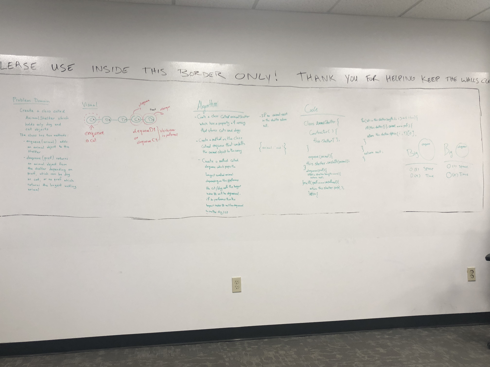

# First-in, First out Animal Shelter.
<!-- Short summary or background information -->

## Challenge
using a first-in, first-out approach.
Implement the following methods:
enqueue(animal): adds animal to the shelter. animal can be either a dog or a cat object.
dequeue(pref): returns either a dog or a cat. If pref, a string, is ‘cat’ return the longest-waiting cat. If pref is ‘dog’, return the longest-waiting dog. For anything else, return either a cat or a dog.

## Approach & Efficiency
see algorithm provided in the attached photo

## Solution
