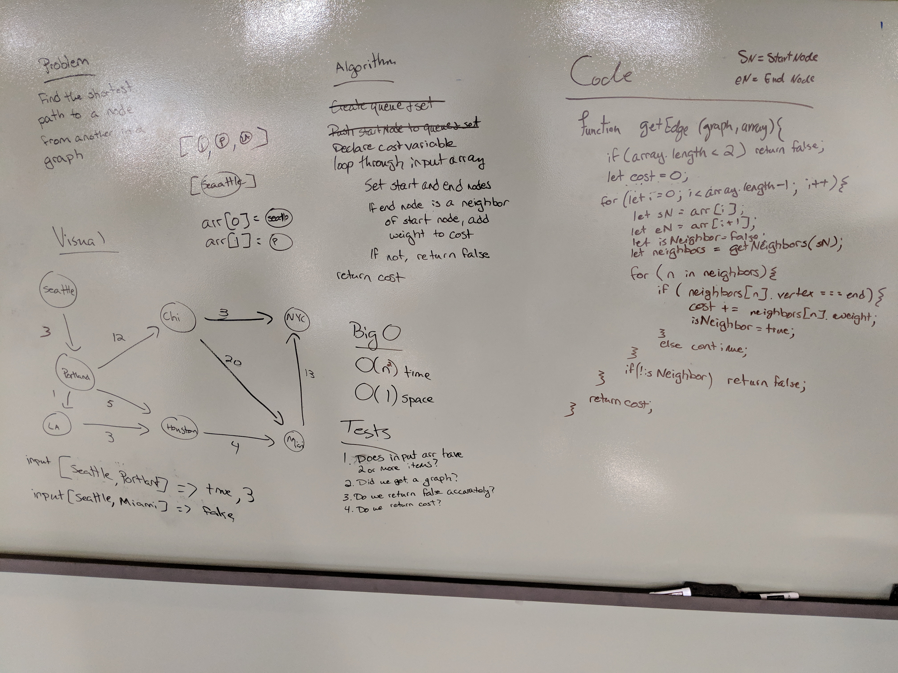

# Breadth-First Traversal of a Graph
- Graph class and methods - Sara Bahrini
- Code Challenge - Sara Bahrini and Jen Carrigan  

## Challenge
- graph class
- breadthFirst method - Extend your graph object with a breadth-first traversal method that accepts a starting node. Without utilizing any of the built-in methods available to your language, return a collection of nodes in the order they were visited. Display the collection.

- getEdge Write a function based on the specifications above, which takes in a graph, and an array of city names. Without utilizing any of the built-in methods available to your language, return whether the full trip is possible with direct flights, and how much it would cost.

## Approach & Efficiency
See the whiteboard screenshots

## Solution

