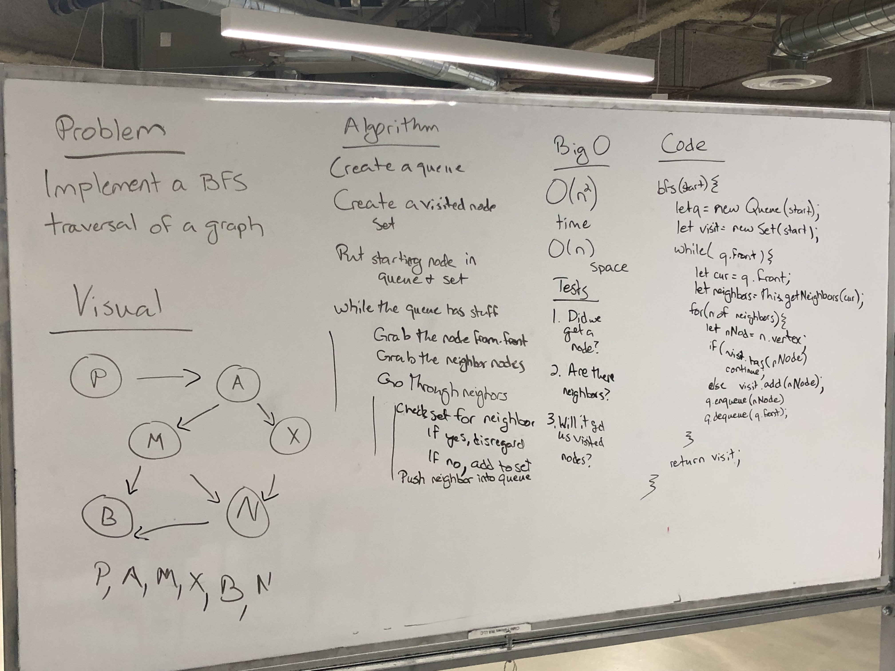

# Breadth-First Traversal of a Graph
- Graph class and methods - Sara Bahrini
- Code Challenge - Sara Bahrini and Jen Carrigan  

## Challenge
- 
- Extend your graph object with a breadth-first traversal method that accepts a starting node. Without utilizing any of the built-in methods available to your language, return a collection of nodes in the order they were visited. Display the collection.

## Approach & Efficiency
<!-- What approach did you take? Why? What is the Big O space/time for this approach? -->

## Solution
