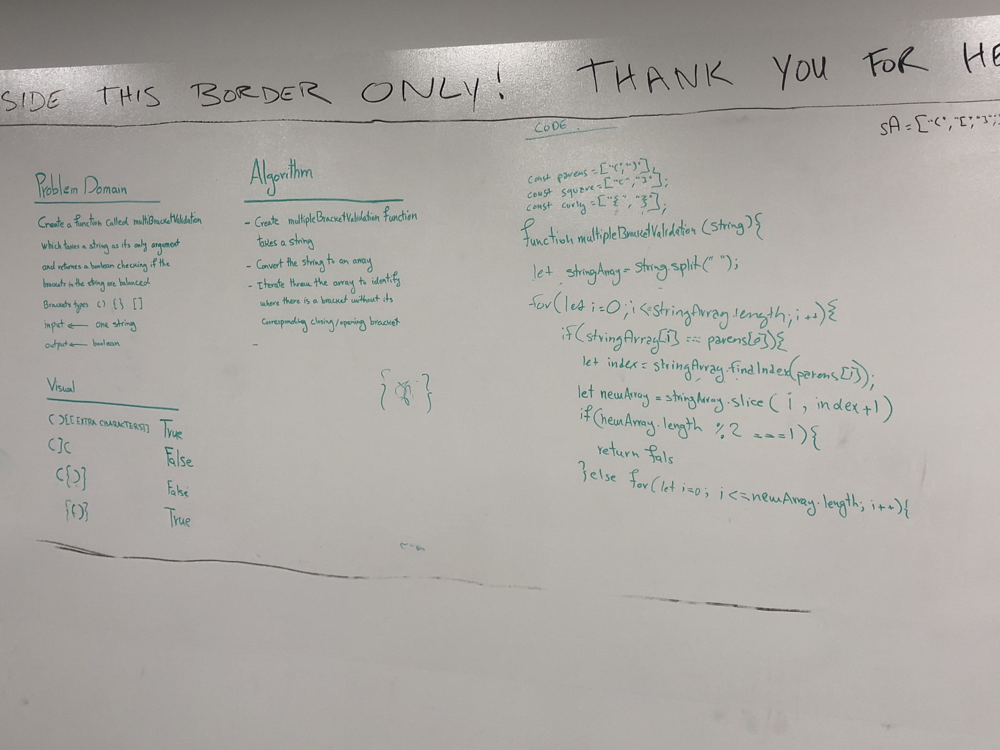

# Multi-bracket Validation.
<!-- Short summary or background information -->

## Challenge
On your main file, create…
JavaScript: a function called multiBracketValidation(input)
Your function should take a string as its only argument, and should return a boolean representing whether or not the brackets in the string are balanced. There are 3 types of brackets:

- Round Brackets : ()
- Square Brackets : []
- Curly Brackets : {}

## Approach & Efficiency
See the algorithm in the attached photo.

## Solution
