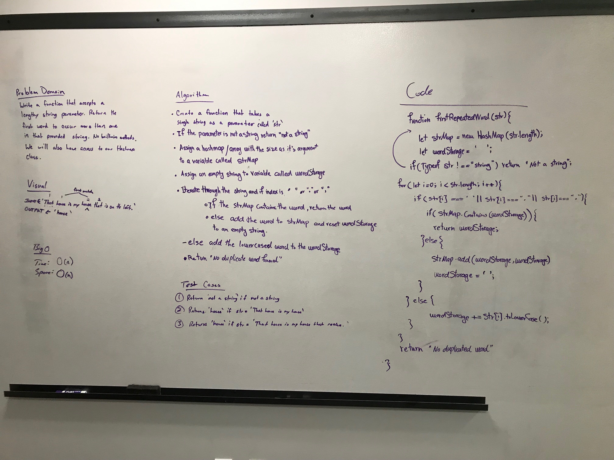

README.md
# First repeated word
Sara and Ben 

## Challenge
Write a function that accepts a lengthy string parameter.
Without utilizing any of the built-in library methods available to your language, return the first word to occur more than once in that provided string.

## Approach & Efficiency
Used hashmap with bif O of n for space and time.

## Solution
