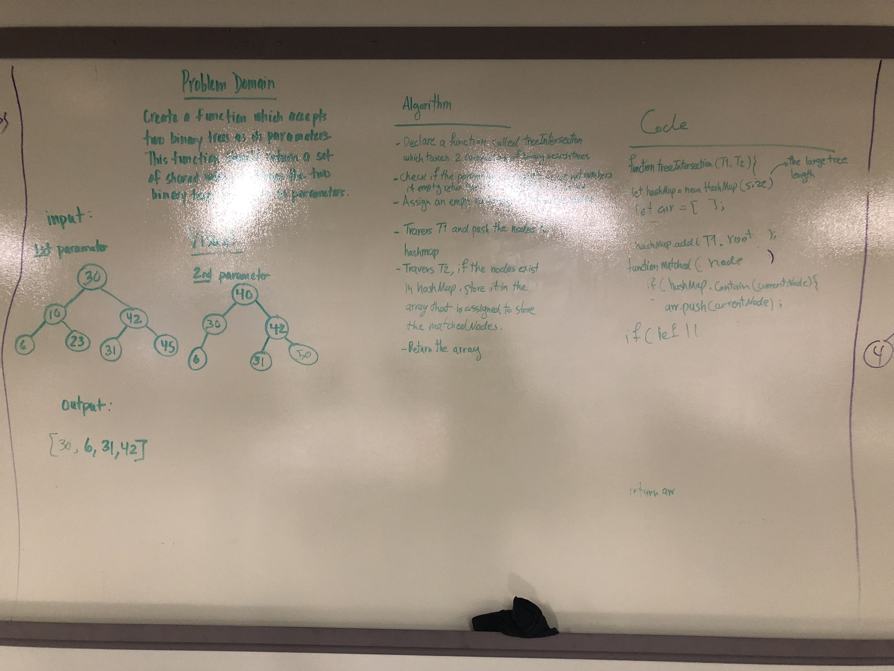

# Intersection of binary trees
Sara Bahrini and George McCadden

## Challenge
Write a function called tree_intersection that takes two binary tree parameters.
Without utilizing any of the built-in library methods available to your language, return a set of values found in both trees.

## Approach & Efficiency
using a hashmap to store one of the tress and an empty map to store the nodes that are existing in the hashmap (matching numbers). Big o of n for both time and space.

## Solution
