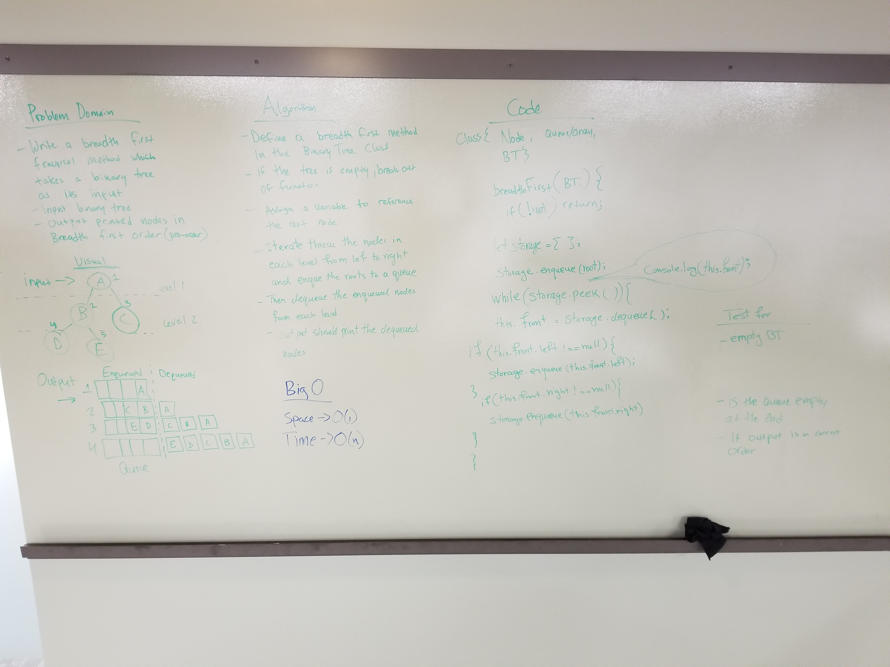

# Trees
<!-- Short summary or background information -->

## Challenge
* Challenge 1:
- Create a Node class that has properties for the value stored in the node, the left child node, and the right child node .
- Create a BinaryTree class:
  Define a method for each of the depth first traversals called preOrder, inOrder, and postOrder which takes in a root node, and returns an array of the nodes.
  At no time should an exception or stack trace be shown to the end user. Catch and handle any such exceptions and return a printed value or operation which cleanly represents the state and either stops execution cleanly, or provides the user with clear direction and output.

- Create a BinarySearchTree class
  Define a method named add that adds a new node in the correct location in the binary search tree.
  Define a method named search that brings in a value of node, and returns the node with the desired value.
* Challenge 2:
  Write a breadth first traversal method which takes a Binary Tree as its unique input. Without utilizing any of the built-in methods available to your language, traverse the input tree using a Breadth-first approach; print every visited node’s value.

## Approach & Efficiency
See attached image for second challenge approach.

## Solution
